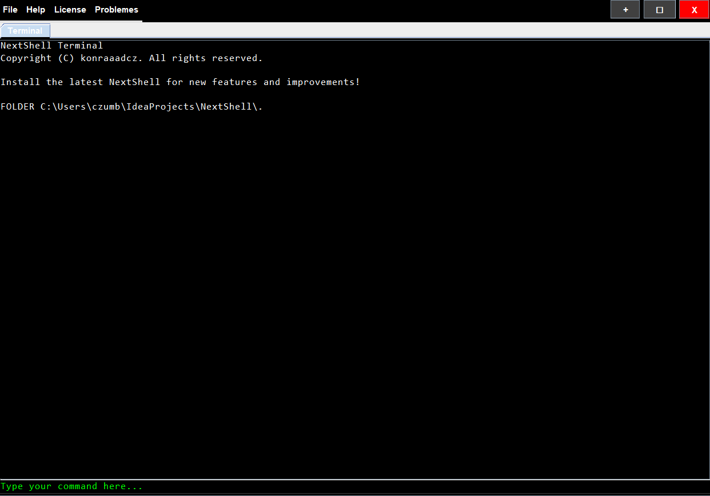

# NextShell

NextShell is a terminal emulator for Windows designed to provide an efficient and modern interface for interacting with your system via a terminal window. It includes multiple customizable features and is built with the ability to run shell commands, display logs, and support a multi-tab environment. The NextShell terminal application also includes features such as version checks, custom commands, and it's my biggest project ever

## Why NextShell?

- **Modern User Interface**
- **Custom Commands** 
- **Multi-Tab Support** 
- **Auto Close** 
- **Memory Optimization** 
- **Real-Time Command Execution** 
- **Cross-Platform Compatibility** 




## Memory Optimization & Automatic Shutdown

NextShell automatically optimizes memory usage in the background and will close terminal tabs after 10 minutes. This helps in reducing memory consumption and improving performance


## Depedencies

- Java 11 or higher (You can download java [here](https://www.oracle.com/java/technologies/downloads/#jdk23-windows))
- Windows' built-in PowerShell terminal


## Custom NextShell commands
  That's all for now, more will be added later:

  1. **Version**
     
     ```
     nextshell --v
     ```
     ```
     nextshell --version
     ```
     
  2. **Updates**
     
     ```
     nextshell --updates
     ```
    
  3. **Docs**
     
     ```
     nextshell --docs
     ```


## License

The software is licensed under [GNU General Public License v3.0](LICENSE). Read it now!


     

   


