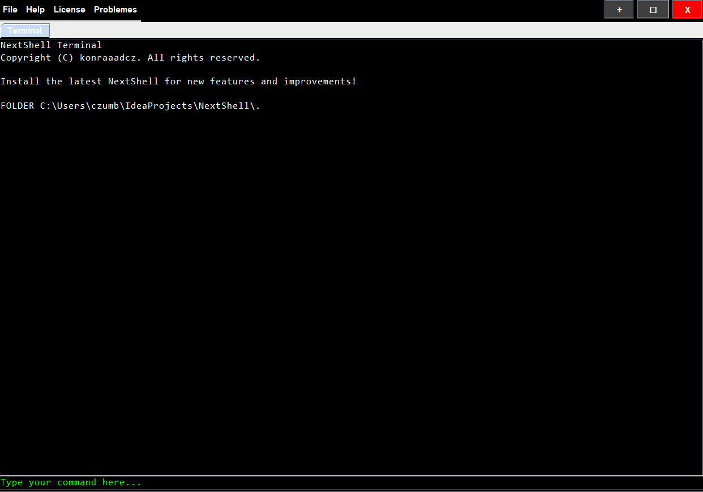

# NextShell

NextShell is a terminal emulator for Windows designed to provide an efficient and modern interface for interacting with your system via a terminal window. It includes multiple customizable features and is built with the ability to run shell commands, display logs, and support a multi-tab environment. The NextShell terminal application also includes features such as version checks, custom commands, and more...

## Why NextShell?

- **Modern User Interface:** A sleek, dark-themed terminal with support for multiple tabs and custom buttons
- **Custom Commands:** Execute custom NextShell commands
- **Multi-Tab Support:** Open and manage multiple terminal tabs in one window
- **Auto Close:** Automatically closes the terminal window after 10 minutes due to resource saving
- **Memory Optimization:** A route to optimize memory usage using garbage collection
- **Real-Time Command Execution:** Executes shell commands in real-time with output shown in the terminal window
- **Cross-Platform Compatibility:** Runs on Windows, with plans for Linux and MacOS support in the future




## Memory Optimization & Automatic Shutdown

NextShell automatically optimizes memory usage in the background and will close terminal tabs after 10 minutes. This helps in reducing memory consumption and improving performance.


## Depedencies

- Windows 10 or higher operating system
- Java 11 or higher (You can download java [here](https://www.oracle.com/java/technologies/downloads/#jdk23-windows))
- Windows' built-in PowerShell terminal

## Installation

There are 2 ways to install:

1. **Manual download**

   [Install](https://github.com/konraaadcz/NextShell/releases) or copy the repository and place it in your chosen folder. Then run the start.bat file:
   ```
   ./start.bat
   ```
   or
   ```
   java src/main/java/net/nextshell/App.java
   ```
   
2. **NextShell Installer**
   
   More information [here](https://github.com/konraaadcz/NextShell/tree/main/installer)


## Custom NextShell commands
  That's all for now, more will be added later:

  1. **Version**
     
     ```
     nextshell --v
     ```
     ```
     nextshell --version
     ```
     
  2. **Updates**
     
     ```
     nextshell --updates
     ```
    
  3. **Docs**
     
     ```
     nextshell --docs
     ```


## Contributing

Read the [Contributing](.github/CONTRIBUTING.md) file for more details!


## License

The software is licensed under [GNU General Public License v3.0](LICENSE). Read it now!


     

   


